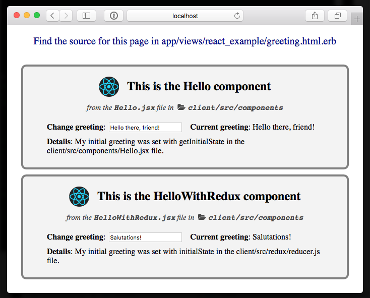

# ReactRailsWebpack

[](https://badge.fury.io/rb/react_rails_webpack)

> Warning: If you are upgrading across major versions, please read the [release notes in the changelog](CHANGELOG.md).

Ruby gem for quickly creating highly customizable react/rails integrations using webpack and npm.

## Key Features

1. One-command setup
2. Use any packages from the [npm](https://www.npmjs.com) ecosystem
3. [Built-in examples](images/demo_page.png) of plain and [redux](http://redux.js.org)-backed React components
4. The [webpack](https://webpack.github.io) development server for React components will live update your changes to any device on your local network (including phones) (gif demo of this feature [here](images/rrw_demo_short.gif))



[more features...](FEATURES.md)

## Install

> Video demo of setup and use on a new Rails app [here](https://vimeo.com/180349372)

1. Make sure you have the [requirements](#requirements) installed
2. Add `gem 'react_rails_webpack'` to your Gemfile
3. Run `bundle install`
4. Run `rails g react_rails_webpack:install` ([further explanation of what this does](#how-does-this-work))

## Requirements

- **[Rails](http://rubyonrails.org/)** version **4 or greater** (check version with `rails -v`)
- **[node](https://nodejs.org)** version **4 or greater** (check version with `node -v`)
- **[npm](https://www.npmjs.com/)** version **3 or greater** (check version with `npm -v`)

## Contents

- **[Key features](#key-features)**
- **[Install](#install)**
- **[Requirements](#requirements)**
- **[About](#about)**
  - [Pros](#pros)
  - [Cons](#cons)
- **[See the demo components in action](#see-the-demo-components-in-action)**
  - [On webpack dev server](#on-webpack-dev-server)
  - [On your Rails app](#on-your-rails-app)
- **[Commands](#commands)**
  - [To set up the integration](#set-up-the-integration)
  - [To set up an example page in your Rails app](#set-up-an-example-page-in-your-rails-app)
  - [To configure a new clone of your repo](#configure-react_rails_webpack-on-a-new-clone-of-your-repo)
  - [To see the url of your webpack development server](#see-the-url-of-your-webpack-development-server)
  - [Integrate with Trailblazer](#generate-react-component-trailblazer-cell)
- **[Suggested development workflow](#suggested-development-workflow)**
- **[Creating and using your own components](#creating-and-using-your-own-components)**
- **[How does this work?](#how-does-this-work)**
- **[Gotchas](#gotchas)**
  - [Forgetting to run npm run build](#forgetting-to-run-npm-run-build)
  - [Forgetting to add components to the availableComponents file](#forgetting-to-add-components-to-the-clientsrcappavailablecomponentsjs-file)
  - [Forgetting to run rails g react_rails_webpack:new_fork when cloning your repo on a new machine](#forgetting-to-run-rails-g-react_rails_webpacknew_fork-when-cloning-your-repo-on-a-new-machine)
  - [npm install vs. npm run install](#npm-install-vs-npm-run-install)
- **[Development](#development)**
- **[Contributing](#contributing)**
- **[License](#license)**

## About

When I looked over the available gems for react/rails integrations, none of them were as customizable as I wanted, so I decided to build my own. Since I wanted it to be as customizable as possible, I made my gem a set of generators, instead of a bunch of under-the-hood gem code. You can customize the inner workings of this integration to your heart's content, since all the files used for the integration will be added directly to your app. You can edit them, delete them, and add or remove any npm packages you like, because this integration allows you to use any npm packages you could use in a static front-end react app.

### Pros:

- [Webpack](https://webpack.github.io/) integration
- Hot-reloading webpack development server
- Ability to see dev server output on any computer (or mobile device) on your network
- Built-in [redux](http://redux.js.org/) integration
- Generators provide example code for basic react components and react-redux components
- Highly customizable
- Ability to use any [npm](https://www.npmjs.com/) packages that you could use on a static front-end app

### Cons:

- This gem does not do server-side rendering. I don't find this makes much of a difference for my apps in practice, but if it does for you, best avoid. [This post by Henrik Joreteg](https://blog.andyet.com/2015/05/18/lazymorphic-apps-bringing-back-static-web) covers some of the reasons I like just doing it this way.


## See the demo components in action

### On webpack dev server

1. Run the webpack dev server with `npm run start`
2. Go to the url specified by the `rake react_rails_webpack:print_server_info` command

### On your rails app

1. Generate an example page in rails with the `rails g react_rails_webpack:create_example_page` command
2. Start your Rails server with `rails s`
3. Go to [localhost:3000/greeting](http://localhost:3000/greeting)

## Commands

### Set up the integration

`rails g react_rails_webpack:install`

Further explanation of what this does [here](#how-does-this-work).

### Set up an example page in your Rails app

`rails g react_rails_webpack:create_example_page`

Sets up an example page in your Rails app at [localhost:3000/greeting](http://localhost:3000/greeting) that displays the two example components.

### Configure react_rails_webpack on a new clone of your repo

`rails g react_rails_webpack:new_fork`

**You must run this whenever you clone a repo with a react_rails_webpack integration setup**. It generates [the environment.json file](lib/react_rails_webpack/client/environment.json) based on your computer's network name. Since the network name will be different for most computers, this file is gitignored and needs to be regenerated for each new computer the project is cloned on.

### See the url of your webpack development server

`rake react_rails_webpack:print_server_info`

This command will tell you the url of your webpack development server on your local network.

### Generate react component Trailblazer cell

`rails g react_rails_webpack:trailblazer_integration`

If you use [the Trailblazer gem](https://github.com/apotonick/trailblazer), use this command to add a trailblazer cell for react components to your `lib` folder.

## Suggested Development Workflow

1. Write the code for your React components in the [client/src/components](lib/react_rails_webpack/client/src/components) directory
2. Test your new components with live reloading by running the webpack dev server with the command `npm run start` (note: the base html page for the webpack dev server is based on the html provided to `context.defaultTemplate` in [the webpack.config.js file](lib/react_rails_webpack/client/webpack.config.js))
3. Add any components you want to spin up with the `react_component` helper in Rails to [the available components file](lib/react_rails_webpack/client/src/app/availableComponents.js) ([further explanation](#creating-and-using-your-own-components))
4. Run the `npm run build` command to compile your javascript files and add them to the Rails assets folder
5. Add calls to the `react_component` helper method in your Rails app to render your React components in views
6. Make sure they still work, repeat steps 1-5 until satisfied

## Creating and using your own components

Let's say you want to make a checkout form component with react. Here's what you'd need to do to use it from Rails:

- Create the component in the [client/src/components](lib/react_rails_webpack/client/src/components) directory
- Add the component to the list of components in the [client/src/app/availableComponents.js](lib/react_rails_webpack/client/src/app/availableComponents.js) file (this file is what makes components available to Rails)

For example, if you called your component `CheckoutForm`, your `client/src/app/availableComponents.js` file might look like this:

```javascript
import CheckoutForm from '../components/CheckoutForm'

export default {
  CheckoutForm: {
    class: CheckoutForm
  }
}
```

Or like this if it's a component that uses redux:

```javascript
import {CheckoutFormContainer} from '../components/CheckoutForm'

export default {
  CheckoutForm: {
    redux: true,
    class: CheckoutFormContainer
  }
}
```

- Wherever you want this component to render in your view, put a call to the `react_component` helper method with the components name and props, like so:

```ruby
render_component :CheckoutForm, { customerName: 'Harper' }
```

NOTE: Unless you're sure you know what you're doing, do not edit anything in the [client/app](lib/react_rails_webpack/client/src/app) folder except [the availableComponents file](lib/react_rails_webpack/client/src/app/availableComponents.js)). Those files are where the integration works it's magic (though of course feel free to read the files to check out how everything works).

## Working with the Webpack Dev Server

`npm run start` will start a webpack development server with hot reloading that is completely independent of your Rails app. You can see the output of this server on any computer or mobile device on your local network by going to the appropriate url (which you can find by running `rake react_rails_webpack:print_server_info`). Any changes you make to your component files will be pushed immediately to all devices looking at the page.

## How does this work?

When you run the install generator like this:

    $ rails g react_rails_webpack:install

This gem will setup a basic react integration with some example components (one standard react component and one using react with redux) under [a client folder](lib/react_rails_webpack/client) in your project's root.

The meat of the integration with Rails is in [the client/app folder](lib/react_rails_webpack/client/src/app), and [the app.js file](lib/react_rails_webpack/client/src/app.js). When your page loads in Rails, if you call the `react_component` method like this:

```ruby
react_component :ComponentName, {myProp: 'some value'}
```

It will create a div that looks like this:

```html
<div class="react-component-target" data-componentname="ComponentName" data-componentprops="{myProp: 'some value'}">
  <script>renderLastComponentDiv()</script>
</div>
```

When your browser hits that `renderLastComponentDiv()` call, it grabs the component name (which is `ComponentName` in this example) from the parent div, then looks it up in [the availableComponents.js file](lib/react_rails_webpack/client/src/app/availableComponents.js).

In our example, your available components file might look like this:

```javascript
import MyComponent from '../components/MyComponent'
import SomeOtherComponent from '../components/SomeOtherComponent'

export default {
  ComponentName: {
    class: MyComponent
  },
  OtherName: {
    class: SomeOtherComponent
  }
}
```

If it looked like that, you would render your `MyComponent` React component with `react_component :ComponentName`, and you would render your `SomeOtherComponent` React component with `react_component :OtherName`. Using `react_component :MyComponent` would NOT work. The `react_component` method is looking for the javascript object keys from [availableComponents.js](lib/react_rails_webpack/client/src/app/availableComponents.js) (e.g. `ComponentName`, `OtherName` ), NOT the actual component class names (e.g. `MyComponent`, `SomeOtherComponent`). It's usually fine to make the object key the same as the class name, though. They're just different in this example for clarity.

Assuming `react_component` finds a key in [availableComponents.js](lib/react_rails_webpack/client/src/app/availableComponents.js) that matches the name it's given, it will immediately render that component within that div, passing in props from the `data-componentprops` attribute. As the page loads, each successive div generated by `react_component` renders this way.

## Gotchas

### Forgetting to run `npm run build`

Remember, while your changes to components will hot reload when you use the webpack dev server, they will not show up at all in your Rails app until you run the `npm run build` command. And they do NOT hot-reload when run in the context of your Rails app.

### Forgetting to add components to the [client/src/app/availableComponents.js](lib/react_rails_webpack/client/src/app/availableComponents.js) file

Components will not be accessible from Rails if you forget to add them here.

### Forgetting to run `rails g react_rails_webpack:new_fork` when cloning your repo on a new machine

`rails g react_rails_webpack:new_fork` sets up [the environment.json file](lib/react_rails_webpack/client/environment.json), which is NOT included in your repo, because it contains information specific to each computer it is generated on.

### npm install vs. npm run install

Usually to install new npm packages, you run the `npm install` command. This will work fine if you do it from the client folder, but it won't work from your project's root, since your package.json file with your project's requirements is in the client folder and not the project's root. However, as a convenience, the project's root has the command `npm run install` which is essentially the same as hopping in and out of the client folder to run `npm install` (it's basically like running `cd client && npm install && cd ..`).

More succinctly: if you're in your project's root folder, use `npm run install` instead of `npm install` to install any new npm package dependencies you've added to the `client/package.json` file.


## Development

After checking out the repo, run `bin/setup` to install dependencies. You can also run `bin/console` for an interactive prompt that will allow you to experiment.

To install this gem onto your local machine, run `bundle exec rake install`. To release a new version, update the version number in `version.rb`, and then run `bundle exec rake release`, which will create a git tag for the version, push git commits and tags, and push the `.gem` file to [rubygems.org](https://rubygems.org).

## Contributing

Bug reports and pull requests are welcome on GitHub at https://github.com/neurodynamic/react_rails_webpack. This project is intended to be a safe, welcoming space for collaboration, and contributors are expected to adhere to the [Contributor Covenant](http://contributor-covenant.org) code of conduct.


## License

The gem is available as open source under the terms of the [MIT License](http://opensource.org/licenses/MIT).

